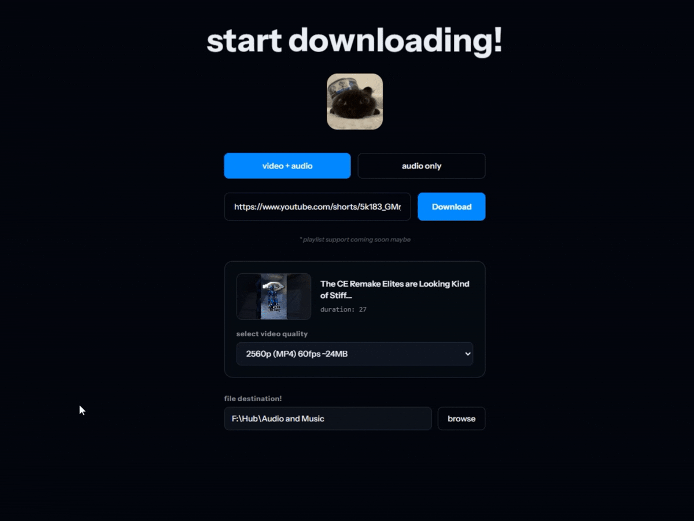

# critterDownloader

a simple YouTube video and audio downloader.

## features

- downloading video & audio in the BEST quality
- no subscriptions
- simple ui/ux
- no dumb ads
- ability to save to path
- changeable themes

## installation

download the latest release and run the installer.

https://github.com/gaknippel/critterDownloader/releases

## usage

1. paste a YouTube link
2. choose video or audio
3. click download! easy!

## built with

- tauri
- react
- yt-dlp
- ffmpeg
- shadcnui
- reactbits

---
# patch notes!
## v1.2.2 - july 3, 2026
- soundcloud links are supported now! also refined the link filtering feature.

---

## v1.2.1 - june 28, 2026
- added an option to use cookies from your browser if signed in on youtube to bypass youtube's bot-checking encryptions. still in beta so it might be broken. 

---

## v1.2.0 - june 28, 2026
- quick fix to patch 1.1.9. added a file destination history for quick access, + ui fixes

---

## v1.1.9 - june 27, 2026
- **`MAJOR UPDATE!!!`** app now checks for updates via latest.json in relases, user can now select quality of chosen video and/or audio, user can now also change the download path in the download path instead of going to settings, and the update ytp-dl actually works now, + various QOL & UI improvements.

---

## v1.1.8 - april 17, 2026
- upgraded the toast feature from sonner, and changed the font for the entire app.

---

## v1.1.7 - april 6, 2026
- added a feature where download path is automatically set to C:/Downloads if the user launches the app for the first time, fixing the null download path issue.

---

## v1.1.6 - february 28, 2026
- added ffmpeg feature which combines audio and video together seamlessly

---

## v1.1.5 - february 5, 2026
- added additional custom themes in appearances tab

---

## v1.1.4 - february 4, 2026
- added github footer on sidebar
- made the links in patch notes direct you to a web browser, instead of inside the app (lmao)

---

## v1.1.3 - february 2, 2026
- added a version icon on the top right
- made most of the text on the app non selectable to make it look nicer

---

## v1.1.2 - february 1, 2026
- changed the about page text
- tested some stability stuff for yt-dlp (wasn't working sometimes)

---

## v1.1.1 - january 30, 2026
- fixed some formatting on the download page that blocked the welcome text

---

## v1.1.0 - january 29, 2026

- added feature to notify user if their version of the app is out of date
- added "updates" panel in settings to update yt-dlp

---

## v1.0.0 - january 28, 2026
### initial release
- chill video downloader made with tauri and shadcnui!
- no pesky ads or sketchy downloaders
- fully open source

---

## upcoming features 
- [ ] download queue
- [ ] multiple simultaneous downloads
- [ ] playlist support
- [ ] download history
- [ ] video quality selection

---

**need help?** [open an issue on github.](https://github.com/gaknippel/critterDownloader/issues)

## follow my main on YouTube!
[My channel:](https://www.youtube.com/@crittercasting) i make souls-like videos and shorts, and just clips of me and my friends messing around 😃

